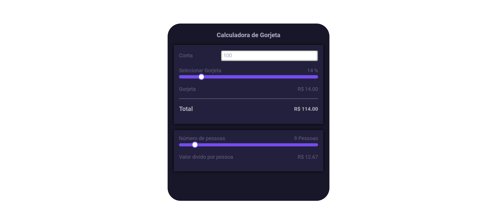
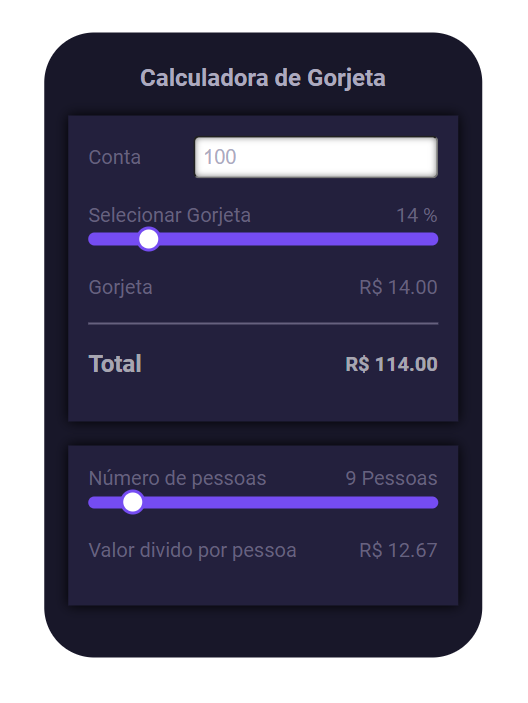

# 📋 Indíce

- [Bem-vindo](#id01)
- [Proposta](#id02)
- [Desafio](#id03)
- [Aprendizado](#id04)
- [Prosseguimento](id05)
- [Screenshots](#id06)
- [Links](#id07)
- [Tecnologias utilizadas](#id08)
- [Pré-requisitos](#id09)
- [Procedimentos de instalação](#id010)
- [Informações](#id011)

# Bem-vindo! 👋 <a name="id01"></a>

**Calculadora de Gorjeta**
<br />

## 🚀 Proposta <a name="id02"></a>

Aplicativo web para calcular a gorjeta a partir de uma conta, porcentagem de gorjeta e número de pessoas. Ele também fornece o total com gorjeta e o valor da conta dividido pelo número de pessoas.
<br />

## :trophy: Desafio <a name="#id03"></a>

- formatarDinheiro(value): Esta função formata o valor para exibição em formato de dinheiro (R$) com duas casas decimais.

- pluralSingular(value): Esta função determina se deve ser usado o singular ou plural dependendo do valor. Retorna "X Pessoa" se o valor for igual a 1 e "X Pessoas" se for maior que 1.

- atualizar(): Esta função é chamada quando o "Atualizar" é selecionado. Ela recupera os valores inseridos pelo usuário, calcula a gorjeta, o total com gorjeta e o valor da conta dividido pelo número de pessoas, e então atualiza os elementos HTML correspondentes com os resultados calculados.

- Além das funções JavaScript fornecidas para calcular a gorjeta e dividir a conta, este projeto inclui estilos CSS para melhorar a aparência e a usabilidade do aplicativo.

## :trophy: Aprendizado <a name="#id04"></a>

#### Construído com:

- Integração HTML, CSS e JavaScript: Aprendizado sobre como essas tecnologias se integram para criar uma aplicação web funcional.

- Manipulação do DOM: Como manipular o Document Object Model (DOM) para interagir dinamicamente com os elementos HTML.

- Tratamento de Eventos: Como lidar com eventos de usuário.

- Pré-processador Sass: Utilização do pré-processador Sass para escrever estilos CSS de forma mais eficiente, com variáveis, mixins e reutilização de código.

- Responsividade: Adaptação do layout e estilos para diferentes tamanhos de tela, proporcionando uma experiência consistente em dispositivos variados.

- Estilização Avançada: Utilização de técnicas avançadas de estilização, como sombras, gradientes, efeitos de hover e ajustes de cores.

- Lógica de Programação: Implementação de uma lógica simples de cálculo baseada em condições e operações aritméticas.

## :trophy: Prosseguimento <a name="id05"></a>

- Realizar outros projetos utilizando o React.js

# :camera_flash: Screenshots <a name="id06"></a>

## :video_camera: Video

https://github.com/RaizaCirne/calculadora-de-gorjeta/assets/109912543/31989f0b-c4a8-438f-84d7-9d7b1bab07b6

## :desktop_computer: Desktop design



## :iphone: Mobile design



<br />

# :heavy_check_mark: Links <a name="id07"></a>

<br />

- Para acessar o site [Clique aqui](https://660c338b35af304905bfa19b--dashing-haupia-302e32.netlify.app/)

<br />

# 🛠 Tecnologias utilizadas <a name="id08"></a>

<br />

- JavaScript
- Git
- SASS
- CSS3
- HTML5

<br />

# ☑️ Pré-requisitos <a name="id09"></a>

<br />

- [x] Editor de código de sua preferência (recomendado VS code)
- [x] Git

<br />

# 📝 Procedimentos de instalação <a name="id010"></a>

<br />

Clone este repositório usando o comando:

```bash
git clone https://github.com/RaizaCirne/calculadora-de-gorjeta.git
```

Baixar arquivo zip

Extrir arquivos

Abrir pasta no editor de código.

<br />

# :sunglasses: Informações <a name="id011"></a>

<br />

- Personal Page - [Raíza Cirne Braz](https://660c338b35af304905bfa19b--dashing-haupia-302e32.netlify.app/)
- Frontend Mentor - [@RaizaCirne](https://www.frontendmentor.io/profile/RaizaCirne)
- GitHub - [RaizaCirne](https://github.com/RaizaCirne)
- LinkedIn - [Raíza Cirne Braz](https://www.linkedin.com/in/ra%C3%ADzacirne/)

**JavaScript - GIT - SASS - CSS3 - HTML5** 🚀
